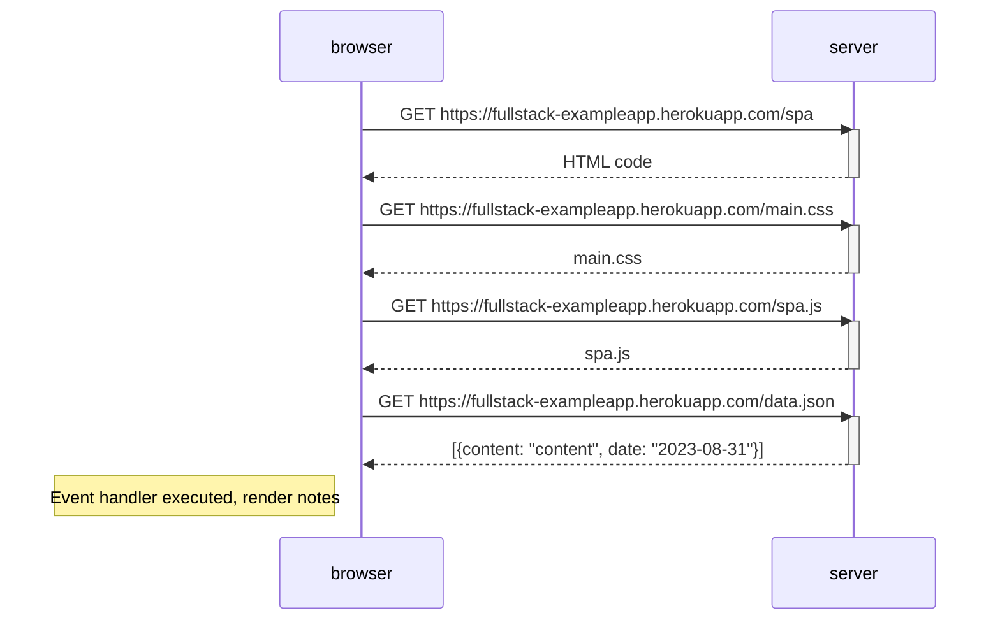

```mermaid
sequenceDiagram
    participant browser
    participant server

    browser->>server: GET https://fullstack-exampleapp.herokuapp.com/spa
    activate server
    server-->>browser: HTML code
    deactivate server

    browser->>server: GET https://fullstack-exampleapp.herokuapp.com/main.css
    activate server
    server-->>browser: main.css
    deactivate server

    browser->>server: GET https://fullstack-exampleapp.herokuapp.com/spa.js
    activate server
    server-->>browser: spa.js
    deactivate server

    browser->>server: GET https://fullstack-exampleapp.herokuapp.com/data.json
    activate server
    server-->>browser: [{content: "content", date: "2023-08-31"}]
    deactivate server

    Note left of browser: Event handler executed, render notes

    
```