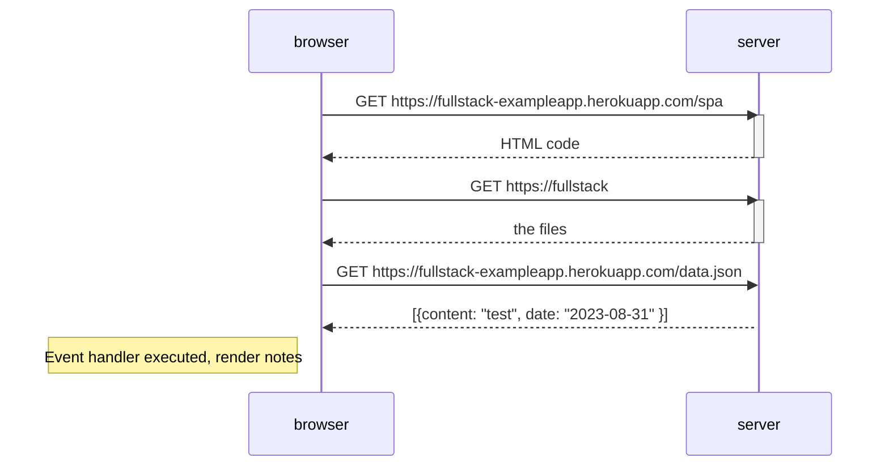

```mermaid
sequenceDiagram
    participant browser
    participant server

    browser->>server: GET https://fullstack-exampleapp.herokuapp.com/spa
    activate server
    server-->>browser: HTML code
    deactivate server

    browser->>server: GET https://fullstack
    activate server
    server-->>browser: the files
    deactivate server

    browser->>server: GET https://fullstack-exampleapp.herokuapp.com/data.json
    activate server
    server-->>browser: [{content: "test", date: "2023-08-31" }]

    Note left of browser: Event handler executed, render notes

    
```