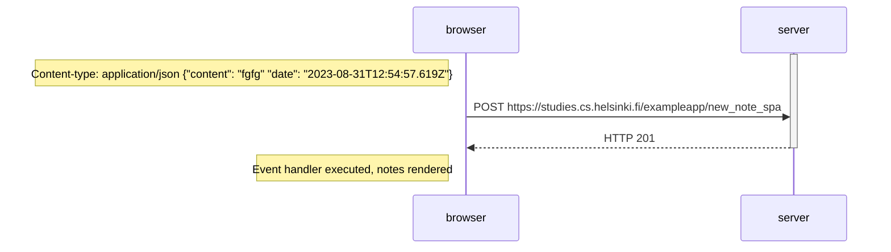

```mermaid
sequenceDiagram
    participant browser
    participant server

    activate server
    Note left of browser: Content-type: application/json {"content": "fgfg" "date": "2023-08-31T12:54:57.619Z"}


    browser->>server: POST https://studies.cs.helsinki.fi/exampleapp/new_note_spa
    server-->>browser: HTTP 201
    deactivate server

    Note left of browser: Event handler executed, notes rendered

    

    
```